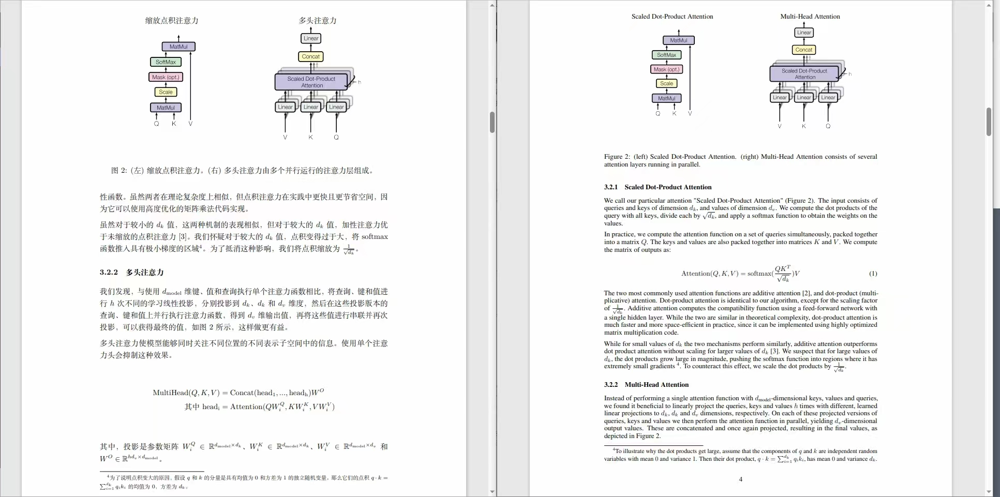
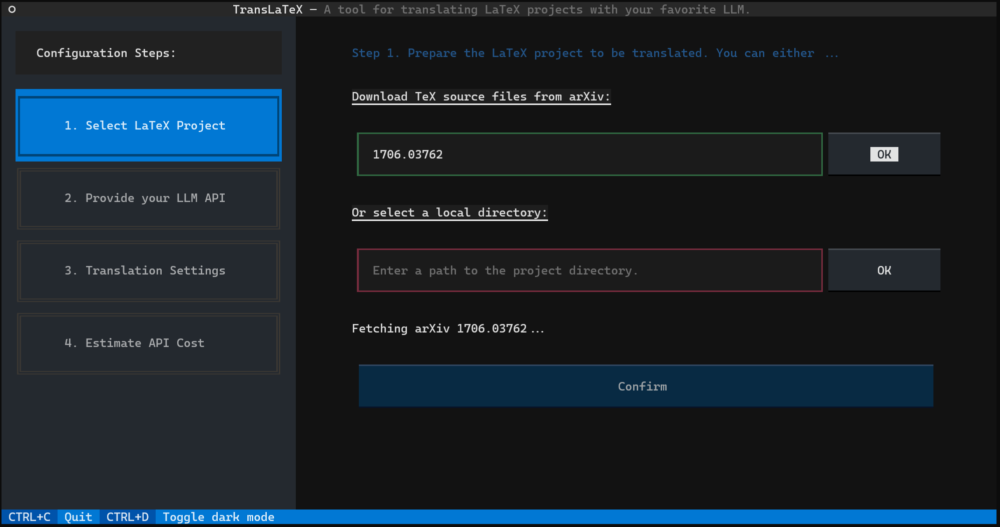

# TransLaTeX

TransLaTeX is a simple tool for translating LaTeX projects using Large Language Models. It can automatically translate LaTeX sources from any language to any other language with precision and customization.

:arrow_forward: [为什么有这个项目？](./docs/why_this_translator.md)

:arrow_forward: [用户指南](./docs/user_guide_zh.md)

建设初期，可能有较多 bug，欢迎[报告问题](https://github.com/habaneraa/TransLaTeX/issues/new/choose) | 中文 UI 有待填坑，目前进度 0%

## Screenshots

Paper that is automatically translated by TransLaTeX:



Intuitive text-based user interface:



## Quick Start

Install TransLaTeX with [pipx](https://github.com/pypa/pipx):

```bash
pipx install git+https://github.com/habaneraa/TransLaTeX.git
```

And launch the app in CLI directly!

```bash
trans-latex
```

If you do not use pipx, you can install TransLaTeX in your Python virtual environment.

Create a **Python 3.12 virtual environment** and run:

```bash
pip install git+https://github.com/habaneraa/TransLaTeX.git
```

Or clone the source code:

```bash
git clone https://github.com/habaneraa/TransLaTeX.git
cd TransLaTeX
pip install . -e
```

Then launch the application by:

```bash
python -m trans_latex
```

## FAQ

Q: How to copy/paste texts in the TUI?

A: Try Ctrl+Shift+C/V. This works on Windows Terminal.

## TODO List

- [ ] Show proper error messages when API requests fail

## How does it work?

1. Parse the main document source file and recursively find all referenced .tex source files.
2. Automatically divide the LaTeX texts into smaller pieces with a proper size (smaller than a given chunk size).
3. Use LLM API service (e.g. ChatGPT from OpenAI) to translate all of the LaTeX text chunks.
4. Create a new project with the translated files, keeping the project structure unchanged.
5. Compile the source and obtain the translated paper! (by yourself)
